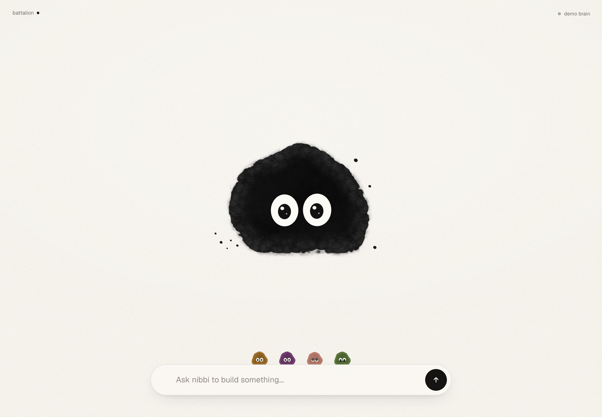

# Nibbi

**An always-on build partner with a face.** Nibbi is a little ink-blot character on a sheet of paper and one line to talk
to it. It runs on your Mac, remembers your projects in a plain-markdown vault, dispatches fixer agents into isolated git
worktrees, tests and merges their work, and shows everything it does — in the chat, as it happens.

<p align="center"></p>

- **Talk** (type or voice) → Nibbi answers as itself; every tool it touches is a step row that folds away.
- **Build**: `/new <name> web|game` scaffolds a project · `/fix <issue>` dispatches a fixer · `/diff` `/review` `approve & merge`.
- **Let it run**: `/goal finish M9` — auto mode dispatches, tests and merges toward the goal; a watchdog unsticks it;
  landings arrive as bubbles (and macOS notifications).
- **Remember**: a git-versioned vault (`~/NibbiVault`) holds plans, issues, journal — readable in any editor or Obsidian.
- **Play**: `/play <project>` launches a project's dev server and opens it.

Brains: **Claude** through your own Claude Code login (Max/Pro) — no API keys on disk. Voice (optional, Apple Silicon):
Kokoro TTS + whisper STT, local.

## Install (macOS)

Requirements: macOS 13+, [Node 22+](https://nodejs.org), git (`xcode-select --install`), a Claude Max/Pro account.

```bash
git clone https://github.com/mcshera/nibbi.git ~/Nibbi-app && cd ~/Nibbi-app
bash install.sh              # add --voice for local speech (Apple Silicon), --no-app to use the browser instead
claude                        # once: log in to Claude Code if you haven't (Nibbi's brain uses that login)
```

`install.sh` creates `~/.nibbi` (state), `~/NibbiVault` (your brain, git), `~/NibbiWork` (fixer worktrees),
`~/NibbiProjects`, installs the daemon's dependencies, registers two background services (`com.nibbi.gateway` — the
brain on :4519, `com.nibbi.host` — the app host on :4527), and installs **Nibbi.app** from the latest release. Re-run it
any time; `bash uninstall.sh` removes services and app but keeps your vault and projects. Health: `~/.nibbi/bin/nibbi-doctor`.

The app is ad-hoc signed (no Apple developer certificate yet): if macOS says it "cannot be opened", right-click →
Open once, or use the browser at `http://127.0.0.1:4527`.

## Anatomy

```
install.sh · uninstall.sh   one-command setup on a fresh Mac (idempotent)
server.mjs                  zero-dep app host: serves public/, proxies /api/* → daemon, event log + SSE, goals, watchdog
public/                     the surface: nibbi.js (character engine), app.js (chat, build loop, agents, voice), styles.css
daemon/                     the brain: Claude Agent SDK session, vault memory, fixers (worktrees + merge gate), auto mode, crons
vault-template/             SOUL / AGENTS / MEMORY / HEARTBEAT stubs your vault starts from
launchd/templates/          background services (rendered with your paths by install.sh)
desktop/                    Tauri v2 shell → Nibbi.app (tray, ⌥Space, notifications, Dock badge)
site/                       nibbi.com (Cloudflare Pages)
tools/ · tests/             scenario screenshots + unit tests (`npm test`)
docs/                       plans, chat plan, fresh-install test protocol
```

## How to test a fresh install
See `docs/FRESH-INSTALL.md` — the checklist for a second Mac (or a new macOS user account), what "good" looks like at
each step, and how to reset and try again.

## On your phone (parked)

The phone app (installable PWA, LAN token gate, local-CA https, `/phone` pairing) lives on the **`phone`** branch —
`git checkout phone`. `main` stays loopback-only: the host binds 127.0.0.1 unless started with `--remote`.

## Talking to it

- **Type** anything; `Enter` sends, `Shift+Enter` newline. Any letter key focuses the pill.
- **Talk**: mic button (appears when you hover/focus the pill) or `⌥ Space`. Recording stops itself after
  1.4 s of silence → `/api/transcribe` (whisper on the gateway) → sent.
- **Hear it**: voice is on by default (status menu → `voice: on/off`). Nibbi speaks the `»voice:` line Oracle
  writes, or the first two sentences of the reply, via `/api/say` (Kokoro). The body bobs to the audio.
- **Images**: paste or drop up to 4 — sent with the message (Oracle has vision).
- **Slash commands** pass straight through: `/fixers`, `/fix <issue>`, `/playtest shipless`, `/approve <id>` …
- **`/play <project>`** (`… stop` / `… status`) launches a project's web dev server through the gateway's sanctioned
  launcher (`/api/play`, detached, logged to `~/.nibbi/play-<project>.log`, auto-stopped after an hour) and opens the
  URL. Oracle's own Bash is deliberately allowlisted (`policy.ts`) and cannot do this — Nibbi offers a `launch <project>`
  chip whenever Oracle talks about running a server, and `play <project>` in the focus suggestions.
- **While it works**: the send button becomes a stop square — click to stop watching (Oracle keeps working).
- **Escape** clears the input, then blurs, then tidies the whole table back to idle (a 6 s `undo` toast brings it
  back). Double-click Nibbi does the same. Click Nibbi for a hop.
- The conversation reads **top to bottom** like any chat: newest at the bottom, pinned there while Nibbi streams; scroll
  up to read and a `↓ latest` button brings you back. Only the latest turn keeps its action chips. In conversation Nibbi
  shrinks to a small presence at the top so the chat gets the room. `pick up where we left off` / `/recent` restores the
  last exchanges with time separators. Slash-command output renders as plain mono text. Plan: `docs/CHAT-PLAN.md`.

## The build loop (v0.3)

Type `/` for the palette. Nibbi answers these itself (no model call; they use the gateway's sanctioned actions):

| command | what happens |
|---|---|
| `/project [name]` | show or switch the active project (persisted); status menu row cycles it |
| `/new <name>` | git repo in `~/NibbiProjects/<slug>`, registered with Oracle, becomes active → `plan it` |
| `/fix <issue>` | dispatches a fixer on the active project (`POST /api/fix`); it appears on the pill |
| `/diff <id>` | inline diff viewer (diffstat, coloured hunks) with `preview` · `approve & merge` (two-click) · `stop` · `steer` |
| `/plan [project]` | milestones from `plans/<project>.md` with progress bars + auto state → `dispatch next`, `pause auto` |
| `/auto <project> <off\|suggest\|stage\|ship\|pause\|resume>` | steer autonomy; the foreman card has the same ladder |
| `/play <project> [stop\|status]` | launch/stop the dev server and open it |
| `/steer <id> <note>` · `/stop <id>` · `/log <id>` | talk to, stop, or read a running fixer |
| `/artifacts [project]` · `/report [hours]` · `/history <q>` · `/vault <path>` · `/journal [day]` · `/model [name]` · `/help` | proof of work, overnight report, search, brain files, journal, model |
| `/review [project\|all]` | walk staged fixers one at a time: `j/k` next/prev · `a` approve (confirm) · `x` discard · `p` preview · merge whole group |
| `/issue <text>` | file an issue into the vault for the active project (`games|projects/<p>/issues.md`), with `fix it now` |
| `/new <name> web\|game` | web = vite scaffold + `npm install` (→ `/play` works); game = rules/design docs + a plan in the vault |
| `/plan edit <instruction>` | Oracle rewrites the plan file |
| `/goal <text>` · `/goal` · `/goal stop` | run the active project toward a goal for as long as it takes: auto goes on (focused on the milestone you name, e.g. `finish M9`), the host's **watchdog** nudges Oracle whenever nothing is in flight for 8 min with tasks pending (15/45 min without a goal), every landing is a bubble, and a 🎯 bubble marks the goal reached |
| `/phone` | pair your phone (QR + steps) |
| `/deploy <project>` | runs the project's own `npm run deploy` (two-click confirm, live log). Nibbi's own deploy rebuilds + installs `Nibbi.app` |
| keys `d` `p` `a` `s` `o` (input unfocused) | diff · preview · approve (twice) · stop · open — on the newest turn |

Oracle's own commands still pass through: `/approve`, `/preview`, `/fixers`, `/playtest`, `/endtest`, `/golden`, `/proposals`, `/export`, `/clear`.

**Fleet events**: the host watches the gateway itself (every 5 s, always on) and streams transitions to the surface (`/nibbi/events`, replayed from `~/.nibbi/nibbi-events.jsonl`), so "while you were away" is exact even if the window was closed. When a fixer finishes, fails or merges, Nibbi posts one bubble with `diff · preview ·
approve & merge` (or `log · requeue`), plus thumbnails of any screenshots the fixer wrote (`<repo>/.oracle-shots/`).
**Playtest mode** (`/playtest <game>`): the pill gets a tag and the chips become `bug · balance · idea · rules question`
prefixes. The status menu shows lifetime spend and rate-limit state. Agent cards on the pill carry the same actions; auto mode lives in the project menu (top-left), not as an agent. Every irreversible chip (merge, stop, ship, unqueue) needs a second click.

**Chips come from meaning**: Oracle ends replies with `»acts: a | b | c` (SOUL policy 5) and Nibbi renders them; a yes/no regex is only the fallback for genuine yes/no questions.

See `PLAN.md`, `docs/CHAT-PLAN.md` and `docs/IMPROVEMENT-PLAN.md` for the roadmap; `CHANGELOG.md` for what shipped.

## How it's contextual

| moment | what shows up | what Nibbi does |
|---|---|---|
| idle | character + pill | breathes, blinks, wanders, occasional ink speck; sleeps after 3 min |
| pill focused, empty | mic, 3–4 suggestion chips from live state (staged fixes, running fixers, playtest, morning) | looks at the pill |
| sent | your line, then a thinking dot | moves to the top, eyes up-left, ink bubbles faster |
| tool events | step rows: `reading ×3`, `editing`, `running a command`, `fixer · … → done` | looks down at the work, drips |
| streaming text | words appear under the character | bobs per word (or to the audio) |
| done | markdown reply (rendered live while streaming), folded steps `5 steps · 8s — show`, follow-up actions under the reply (`ship it`, `open preview`, `yes/not now`, or `go on`/`show me`) | happy hop, then idle |
| error | red-ink message + recovery chips (`try again`, `how to re-login`, `start the gateway`) | wide eyes, flatten, spatter |
| 40 s quiet after a reply | conversation dims to 38 % until you move | keeps breathing |
| always (quiet) | the active **project** top-left (`battalion ●`): the dot is the auto mode — hollow off · ring suggest · grey stage · black ship, pulsing while dispatching. Hover/click: every project with branch, plan bar, the **off · suggest · stage · ship** ladder (ship needs a second click), in-flight/pending/staged, spend, `plan` `play` `fix…`, `+ new project` | — |
| fixers running | one small tinted Nibbi per fixer perched on the pill (dozing = queued, thinking = installing, working = running; happy/shocked for a while when done/failed); hover or click for title · status · model · cost · log tail · `diff` `preview` `approve` `steer` `stop` | — |
| gateway offline | status label for 2.6 s, then just the dot; chips `wake the gateway` / `use the demo brain` | sleeps |

## Protocol (what the surface uses)

`POST /api/send {message, stream:true, images?}` → SSE `tool {name}` · `delta {t}` · `done {text, voice?, costUsd, isError, local?}`
`GET /api/status` · `GET /api/fixers` (polled while a turn runs → fixer state changes become step rows) ·
`GET /api/say?text=` (ogg) · `POST /api/transcribe` (webm) · `GET /nibbi/health` (host + brain reachability).

## Verify

```bash
npm test                # unit tests (node --test) + scenario screenshots → .shots/v-*.png (0 console errors expected)
node tools/shot.mjs "http://127.0.0.1:4527/?demo=1" .shots/x.png --demo "fix the login bug" --at 500,3000,9000 --probe
```

Character rendering came out of the `~/Nibbi/design/variants5` explorations (5f-shader); the eye rig is the
`pip` study from `nibbi-story` (low, wide-set, oversized pupils, twin catchlights — `LOOK` in `nibbi.js`). The name
is one constant (`NAME` in `app.js`, the placeholder in `index.html`).

## Ink animation (what moves, and why)

- **Squash & stretch from motion** — the body elongates along fast travel, the crown trails sideways moves, and it
  lands with a splat (fringe poof + a speck) when it arrives at a new spot. No pool or shadow — the blot sits on bare paper.
- **Living silhouette** — the radial harmonics slowly rotate so the blot never holds one shape; moods change how
  lumpy it is (thinking 1.5×, error tight 0.6×).
- **Boil** — the fringe re-scatters at a mood-dependent rate (idle 9 Hz … working 15 Hz); talking makes it boil harder.
- **Drips** — a bead forms at the belly, hangs, drops and leaves a stain on the paper that dries away. Rare when
  idle, steady while working, frantic on errors. Hop droplets stain too.
- **Wet ink** — the inner wash drifts (slow density variation in the black) and the outer feather breathes.
- **Agents** — fixers appear as small tinted Nibbis (six stable ink colours, hashed from the fixer id), each a separate
  shader pass with its own boil and blink, so they never move in lockstep. (Auto mode is a project setting, not an agent.)
- **Eyes** — lid-based blinks (sometimes double), saccadic gaze, pupils widen when the pointer comes close, and the
  body tilts a little toward what it looks at. Idle shivers every ~45–85 s shake off a couple of specks.
- `prefers-reduced-motion` freezes the boil and disables drips, splats, hops and stretch.

## Review trail

`.shots/REVIEW.md` — the independent design-critic pass (fidelity vs the reference, hierarchy, a11y, copy). Items 1–10 were applied.
